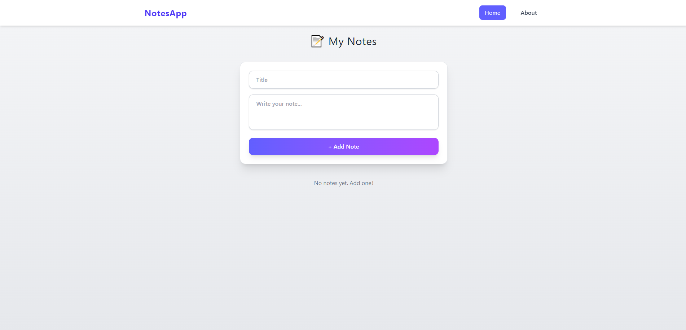
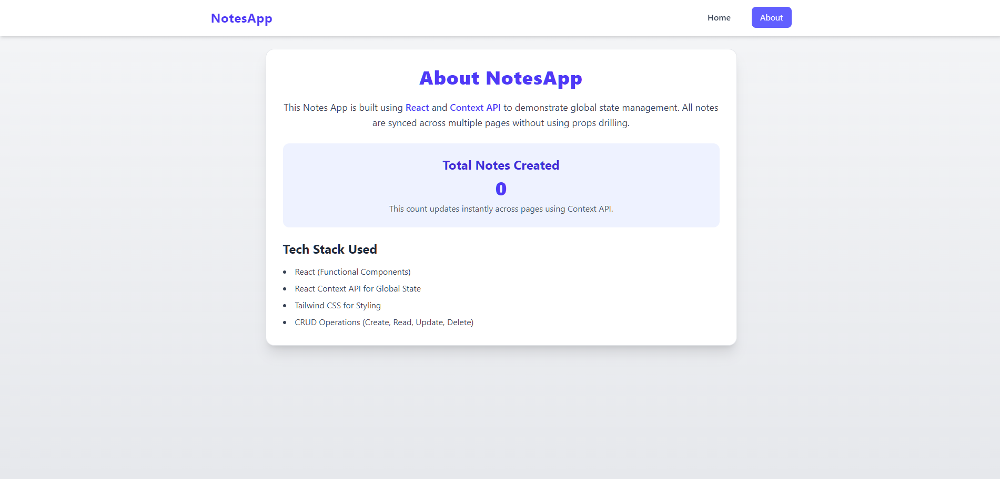

# 📝 Notes App (React + Context API)

A modern and responsive **Notes Management App** built using **React**, **Context API**, and **Tailwind CSS**.  
Users can create, edit, and delete notes with data persisted using **LocalStorage**.

---

## 🚀 Live Demo

🔗 https://notes-app-react-xi.vercel.app/

💻 GitHub Repository:  
https://github.com/MuqtasidBhatti/notes-app-react

---


## 📸 Screenshot





---

## ✨ Features

- Create notes
- Edit existing notes
- Delete notes
- Real-time UI updates using Context API
- LocalStorage persistence
- Responsive UI
- Simple and clean design

---

## 🛠 Tech Stack

- React (Functional Components)
- React Router
- Context API (Global State)
- Tailwind CSS
- Vite
- LocalStorage

---

## 📂 Project Structure

```
src
├── components
│   ├── Navbar.jsx
│   ├── Home.jsx
│   └── About.jsx
│
├── context
│   └── notesContext.jsx
│
├── App.jsx
├── main.jsx
├── App.css
└── index.css

public
└── screenshots
    ├── Home.png
    └── About.png
```

---

## ⚙️ Installation & Setup

Clone the repository

```bash
git clone https://github.com/MuqtasidBhatti/notes-app-react.git
```

Install dependencies

```bash
npm install
```

Run the development server

```bash
npm run dev
```

Open in browser

```
http://localhost:5173
```

---

## 📌 Key Learning

This project demonstrates:

- Implementing **CRUD operations in React**
- Managing **global state using Context API**
- Using **LocalStorage to persist data**
- Structuring a scalable React application
- Building responsive UI using **Tailwind CSS**

---

## 🔮 Possible Improvements

- Add search functionality
- Add note categories or tags
- Add dark mode
- Add backend database (MongoDB / Firebase)
- User authentication

---

## 👨‍💻 Author

**Muqtasid Bhatti**

GitHub:  
https://github.com/MuqtasidBhatti

---

⭐ If you like this project, feel free to **star the repository**.
